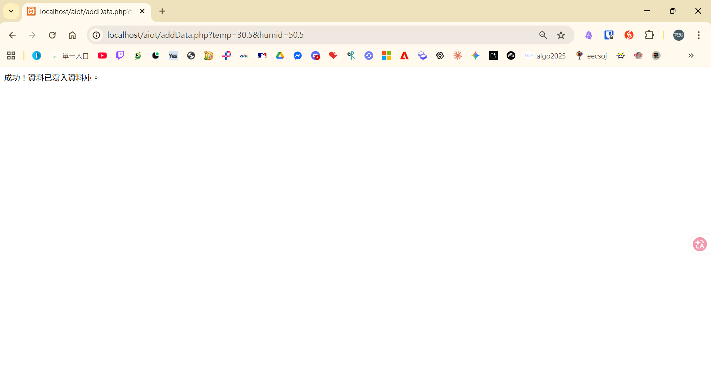
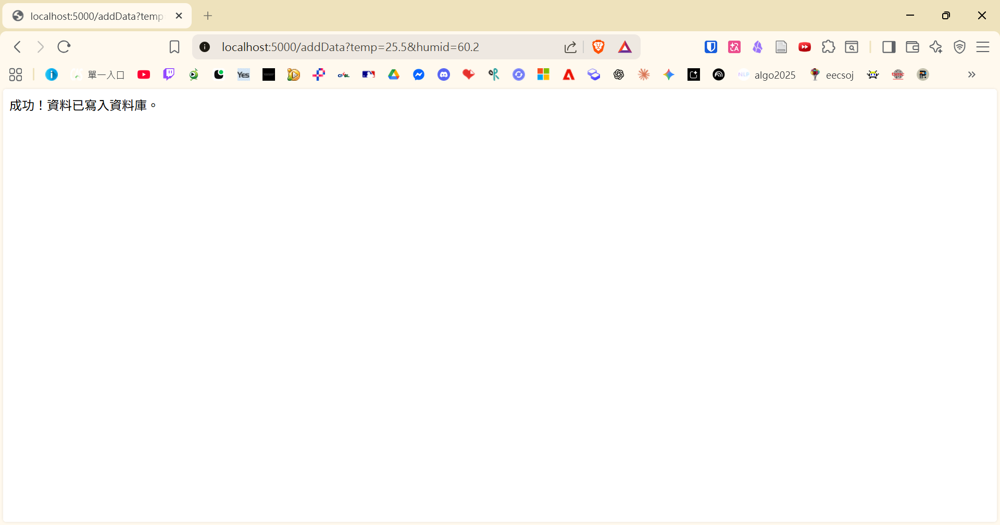

# 物聯網資料記錄系統 (IoT Data Logging System)

此專案展示了一個小型的物聯網資料收集工作流程。專案分為兩個階段：

*   **DIC3-1**：使用 PHP 與 MySQL 實作的早期版本。
*   **DIC3-2**：升級為 Python Flask 與 SQLite 的現代化輕量版本。

---

## DIC3-1：PHP 與 MySQL 實作

這是第一階段的實作，使用 PHP 接收 HTTP GET 請求並將資料寫入 MySQL 資料庫。

### 環境需求
*   Apache 網頁伺服器（例如透過 XAMPP）
*   PHP 運行環境
*   MySQL 資料庫

### 資料庫設定
請事先在您的 MySQL 中建立名為 `aiotdb` 的資料庫，並建立 `sensors` 資料表：

```sql
CREATE DATABASE aiotdb DEFAULT CHARACTER SET utf8 COLLATE utf8_general_ci;

USE aiotdb;

CREATE TABLE sensors (
    id INT AUTO_INCREMENT PRIMARY KEY,
    temp FLOAT,
    humid FLOAT,
    created_at TIMESTAMP DEFAULT CURRENT_TIMESTAMP
);
```

> **注意**：請確保您在 `addData.php` 中設定了正確的資料庫帳號密碼。

### 使用教學
1.  將 `addData.php` 放在您的網頁伺服器目錄下（例如 `htdocs/aiot/`）。
2.  透過 HTTP GET 請求發送感測器資料至伺服器：
    ```
    http://localhost/aiot/addData.php?temp=30.5&humid=50.5
    ```


---

## DIC3-2：Flask 與 SQLite 移轉

專案的第二階段將後端升級為 Python Flask，並使用 SQLite 做為資料庫，以提升跨平台的相容性並簡化部署。這個版本不需要額外架設 MySQL 伺服器。

### 環境需求
*   Python 3.x

### 安裝相依套件
打開命令提示字元或終端機，進入專案目錄，並安裝 Flask：

```bash
pip install -r requirements.txt
```

### 啟動應用程式
在專案目錄下執行以下指令啟動 Flask 伺服器：

```bash
python app.py
```
伺服器將會監聽在 `http://localhost:5000` (或 `http://0.0.0.0:5000`)。
應用程式會在第一次啟動時，自動建立 `aiotdb.db` 資料庫檔案以及其內部所需的 `sensors` 資料表。

### 使用教學
與 DIC3-1 類似，透過 HTTP GET 請求發送感測器資料，但此時要發送到 5000 port (預設)：

```
http://localhost:5000/addData?temp=25.5&humid=60.2
```
如果成功，您會在瀏覽器上看見 `成功！資料已寫入資料庫。` 的回傳訊息。


